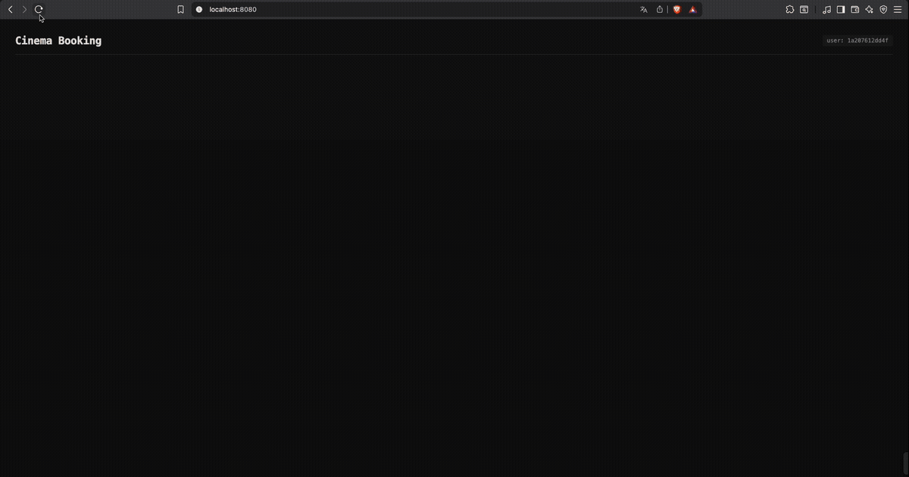
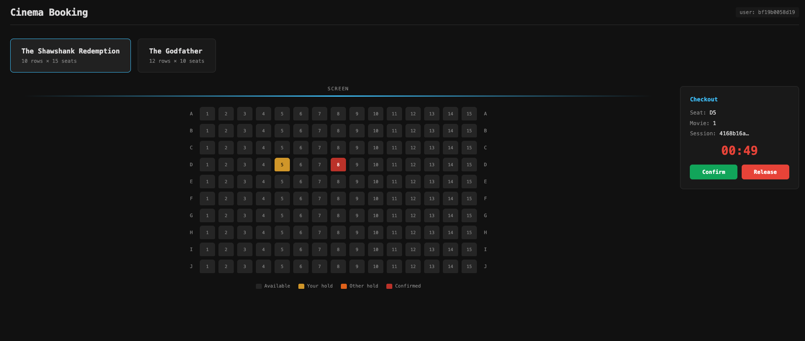
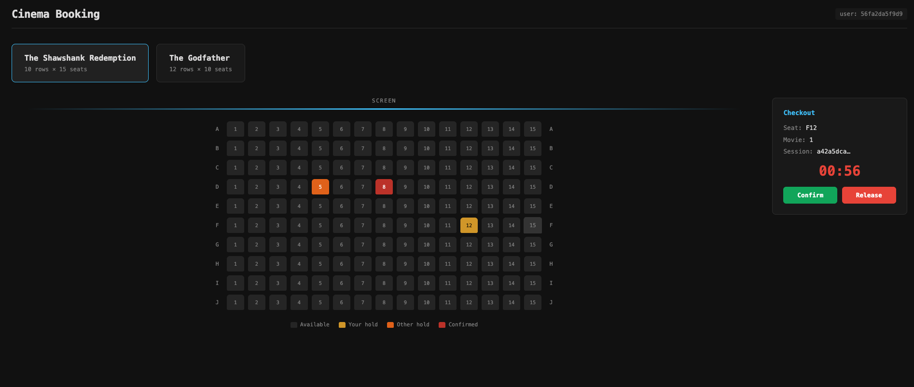

# Cinema Booking — Real-Time Seat Reservation

> Solution à un problème classique de concurrence : plusieurs utilisateurs qui essaient de réserver le même siège en même temps.

<div align="center">


</div>

---

## Démo



---

## Aperçu





---

## Lancer le projet

**1. Démarrer Redis**

```bash
docker compose up -d
```

Cela lance :
- Redis sur `localhost:6379`
- Redis Commander (UI) sur `localhost:8081` — pour voir les clés en temps réel

**2. Lancer le serveur Go**

```bash
go run cmd/main.go
```

**3. Tester la concurrence**

Ouvre **plusieurs onglets** sur [http://localhost:8080](http://localhost:8080).
Chaque onglet est un utilisateur différent (UUID généré côté client).
Essaie de cliquer sur le même siège depuis deux onglets simultanément — un seul réussit, l'autre reçoit un `409 Conflict`.

On voit en temps réel l'occupation des sièges ainsi que ceux qui sont "en cours de réservation" par les autres utilisateurs.

---

La grille se rafraîchit toutes les 2 secondes — les changements des autres onglets apparaissent en temps réel.

---

## Trois implémentations de `BookingStore`

Le projet contient trois implémentations du même contrat :

```go
type BookingStore interface {
    Book(b Booking) error
    Hold(b Booking) (Booking, error)
    ListBookings(movieID string) ([]Booking, error)
    Confirm(ctx context.Context, sessionID string, userID string) (Booking, error)
    Release(ctx context.Context, sessionID string, userID string) error
}
```

### 1. `MemoryStore` — map Go simple

```go
bookings map[string]Booking
```

Stocke les réservations dans une map. Rapide, zéro dépendance.
**Problème** : pas de protection contre les accès concurrents. Deux goroutines peuvent lire `exists = false` en même temps et toutes les deux réserver le même siège — **race condition**.

### 2. `ConcurrentSafeStore` — map + `sync.RWMutex`

```go
bookings map[string]Booking
sync.RWMutex
```

Même structure, mais chaque écriture est protégée par un `Lock()`.
**La vérification + l'écriture sont atomiques** : impossible d'avoir deux réservations simultanées sur le même siège.

```go
func (s *ConcurrentSafeStore) Book(b Booking) error {
    s.Lock()
    defer s.Unlock()
    if _, exists := s.bookings[b.SeatID]; exists {
        return ErrSeatAlreadyTaken
    }
    s.bookings[b.SeatID] = b
    return nil
}
```

**Problème** : tout est en mémoire. Si le serveur redémarre, tout est perdu. Et ça ne fonctionne que sur **une seule instance** — impossible de scaler horizontalement.

### 3. `RedisStore` — `SET NX` + TTL ✅

```go
s.rdb.SetArgs(ctx, key, val, redis.SetArgs{
    Mode: "NX",  // SET if Not eXists
    TTL:  defaultHoldTTL,
})
```

`SET NX` est une opération **atomique côté serveur Redis** : la vérification et l'écriture se font en une seule instruction, sans verrou applicatif.

Avantages :
- **Atomique** : Redis garantit qu'un seul client gagne, même avec 100 000 requêtes simultanées
- **TTL natif** : un siège non confirmé se libère automatiquement après 60 secondes — pas besoin de cron ou de nettoyage manuel
- **Persistant** : les données survivent aux redémarrages du serveur Go
- **Scalable** : plusieurs instances du serveur Go peuvent tourner en parallèle, Redis est la source de vérité unique

---

## Test de charge — 100 000 goroutines sur le même siège

```bash
go test ./internal/booking/ -v -run TestConcurrentBooking
```

Le test lance 100 000 goroutines qui tentent toutes de réserver le même siège (`seat-1`, film `movie-123`) en même temps.

**Résultat attendu :** exactement 1 succès, 99 999 `ErrSeatAlreadyTaken`.

Ce test nécessite Redis en local (`docker compose up -d`).

---

## Visualiser Redis en direct

Pendant le test ou pendant une session de réservation, ouvre [http://localhost:8081](http://localhost:8081).
Tu peux voir les clés `seat:movieID:seatID` et `session:sessionID` apparaître et expirer en temps réel.
